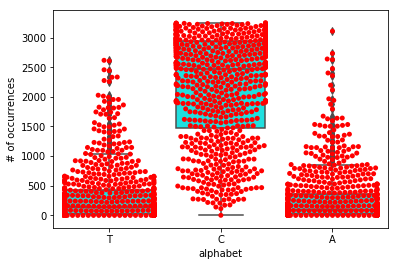
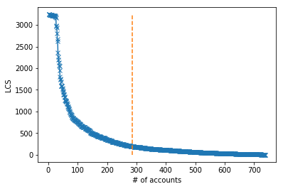
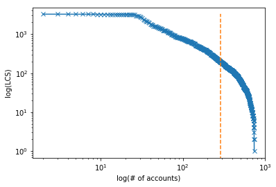
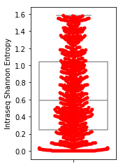
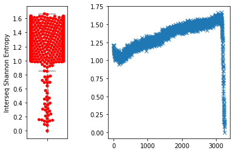
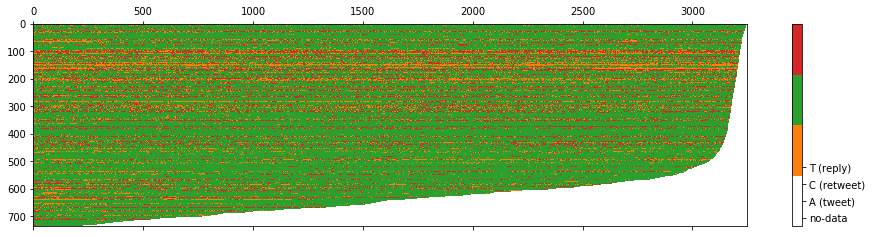

# Digital DNA - python
## Getting Started
This package provides a set of utilities and algorithms for online social bot detection based on the paper [Social Fingerprinting: Detection of Spambot Groups Through DNA-Inspired Behavioral Modeling](https://ieeexplore.ieee.org/document/7876716)

### import libraries
Let's start with the import libraries


```python
import digitaldna as ddna
import csv
from digitaldna import Verbosity
from digitaldna import SequencePlots
import pandas as pd
import numpy as np
from digitaldna.lcs import LongestCommonSubsequence
from os import listdir
import os
from matplotlib import pyplot as plt
import time
from digitaldna import SequencePlots
```

### Sequence your first Digital DNA from Twitter. 
You can sequence from a JSON containing the timeline


```python
from digitaldna import TwitterDDNASequencer

filepath = os.path.join(os.getcwd(), "timelines.json")
model = TwitterDDNASequencer(input_file=filepath, alphabet='b3_type')
data = model.fit_transform()
```


```python

df = pd.DataFrame({"user_id": data[:, 0],
              "dna": data[:, 1]})
df
```


<div>
<style scoped>
    .dataframe tbody tr th:only-of-type {
        vertical-align: middle;
    }

    .dataframe tbody tr th {
        vertical-align: top;
    }

    .dataframe thead th {
        text-align: right;
    }
</style>
<table border="1" class="dataframe">
  <thead>
    <tr style="text-align: right;">
      <th></th>
      <th>user_id</th>
      <th>dna</th>
    </tr>
  </thead>
  <tbody>
    <tr>
      <th>0</th>
      <td>48062712</td>
      <td>CCCCCCCCCCCCCCCCCCCCCCCCCCCCCCCCCCACCCCCCCCCCC...</td>
    </tr>
    <tr>
      <th>1</th>
      <td>2479063608</td>
      <td>AAAAATCTACTAAATATTTTAAATCAAACTTCCAACTAACTAATTC...</td>
    </tr>
    <tr>
      <th>2</th>
      <td>22834067</td>
      <td>ACACCCAAAAACACCCCACAACAAACAAAAAACCACACACAACAAA...</td>
    </tr>
    <tr>
      <th>3</th>
      <td>4289404586</td>
      <td>AAAAAAAAACAAAACCAACCCCACAACCCCAAAAAACTCCAACAAA...</td>
    </tr>
    <tr>
      <th>4</th>
      <td>615597661</td>
      <td>AAAAAAAAAAACAAACCAAAACAAAAAAAAAAAAAATAATAAATTA...</td>
    </tr>
    <tr>
      <th>5</th>
      <td>1135017996</td>
      <td>ACACAAATTTACTAAAATTTCAACTTCATATTTTTATCAAAATAAA...</td>
    </tr>
  </tbody>
</table>
</div>


Or a previously DNA sequenced timeline


```python
filepath = os.path.join(os.getcwd(), "italian_retweets_users_sequences_new.csv")
df = pd.read_csv(filepath)
df
```


<div>
<style scoped>
    .dataframe tbody tr th:only-of-type {
        vertical-align: middle;
    }

    .dataframe tbody tr th {
        vertical-align: top;
    }

    .dataframe thead th {
        text-align: right;
    }
</style>
<table border="1" class="dataframe">
  <thead>
    <tr style="text-align: right;">
      <th></th>
      <th>user_id</th>
      <th>tweet_count</th>
      <th>dna</th>
      <th>bot</th>
      <th>retweets(%)</th>
    </tr>
  </thead>
  <tbody>
    <tr>
      <th>0</th>
      <td>1123481</td>
      <td>3208</td>
      <td>AACCCCCCACAACCCCCCCCCCACACATCAATCCCACCCCCAACCA...</td>
      <td>0</td>
      <td>62</td>
    </tr>
    <tr>
      <th>1</th>
      <td>3500831</td>
      <td>3214</td>
      <td>CCTTACCCCTACTACTTCAAACCAAACAAAACAACCCATCTCCCTT...</td>
      <td>0</td>
      <td>27</td>
    </tr>
    <tr>
      <th>2</th>
      <td>14871003</td>
      <td>3193</td>
      <td>CCTACATACCCCCTCCAAACCACCCACACCACAACCCCCCCCCCCC...</td>
      <td>0</td>
      <td>66</td>
    </tr>
    <tr>
      <th>3</th>
      <td>14906561</td>
      <td>3204</td>
      <td>ACCCCACCCCCCCAAAAAAAACCCCCCCCAAAAACCCCCAACCCCA...</td>
      <td>0</td>
      <td>58</td>
    </tr>
    <tr>
      <th>4</th>
      <td>17880873</td>
      <td>3212</td>
      <td>CCCCTCCTCCCTTCCCTCTTTCCACTCCCTCTCCTTTCCTTTCCCC...</td>
      <td>0</td>
      <td>44</td>
    </tr>
    <tr>
      <th>5</th>
      <td>19017283</td>
      <td>3170</td>
      <td>CCCCCCCCCCCCCCCCCCCCCCCCCCCCCCCCCCCCCCCCCCCCCC...</td>
      <td>1</td>
      <td>100</td>
    </tr>
    <tr>
      <th>6</th>
      <td>20432064</td>
      <td>3195</td>
      <td>TCTTTAACAACCACACAACCCCAAAAAAAATCCCCCAAAACACACC...</td>
      <td>0</td>
      <td>67</td>
    </tr>
    <tr>
      <th>7</th>
      <td>22009205</td>
      <td>3209</td>
      <td>TTTTATAATAATCCCCTCCATATCTCCTCTTTTCATATCTTTTTTC...</td>
      <td>0</td>
      <td>20</td>
    </tr>
    <tr>
      <th>8</th>
      <td>25851958</td>
      <td>3204</td>
      <td>TTACACTTACAACCACTCTACATTCCCACTTTTATTACCCACCTTA...</td>
      <td>0</td>
      <td>45</td>
    </tr>
    <tr>
      <th>9</th>
      <td>32604352</td>
      <td>2463</td>
      <td>CCCCCCCCCCCCCCCCCCCCCCCCCCCCCCCCCCCCCCCCCACCCC...</td>
      <td>1</td>
      <td>79</td>
    </tr>
    <tr>
      <th>10</th>
      <td>33841072</td>
      <td>3201</td>
      <td>TCCACCCTCCCCTACCCCCCCCCCCCACCCCCCCCCCCCCCCCCCC...</td>
      <td>0</td>
      <td>79</td>
    </tr>
    <tr>
      <th>11</th>
      <td>38846888</td>
      <td>3219</td>
      <td>CCCCCACCCCCCCCCCTAACCCACCCACCCCCCCCTCCCCCCCCCC...</td>
      <td>0</td>
      <td>69</td>
    </tr>
    <tr>
      <th>12</th>
      <td>45394510</td>
      <td>3237</td>
      <td>ACTCACACCAAAACACTCCCCTCCCTACCCCCCCCCCCCTCCCCCC...</td>
      <td>0</td>
      <td>79</td>
    </tr>
    <tr>
      <th>13</th>
      <td>50265477</td>
      <td>3185</td>
      <td>CCAACCCCCCCCCCCCCAAAAACCAAAAAAAACCCCCCCCCCCCCC...</td>
      <td>0</td>
      <td>64</td>
    </tr>
    <tr>
      <th>14</th>
      <td>51703470</td>
      <td>3205</td>
      <td>TATAATAAAAATTATTTTAATATATATTAAAAATTAAATAATATAT...</td>
      <td>0</td>
      <td>30</td>
    </tr>
    <tr>
      <th>15</th>
      <td>53002473</td>
      <td>3222</td>
      <td>TCACTCTCCACCAATCCCAACTACCCCCATTCCCTTTTACTTATAT...</td>
      <td>0</td>
      <td>31</td>
    </tr>
    <tr>
      <th>16</th>
      <td>55404019</td>
      <td>3239</td>
      <td>CAAAACAACCCCCCCCAAACAACCCCCCCCCCCCCCCAAACCCCCA...</td>
      <td>0</td>
      <td>67</td>
    </tr>
    <tr>
      <th>17</th>
      <td>58165167</td>
      <td>3170</td>
      <td>CTCTAACCTAAAATAACAAAAATACAAATCCACAAAAAAAACAAAA...</td>
      <td>1</td>
      <td>55</td>
    </tr>
    <tr>
      <th>18</th>
      <td>70741097</td>
      <td>3178</td>
      <td>TCCTCCTCTCTCCCTTTTTTTTTTTTCTCTTTCTCTTTCTTTTCCC...</td>
      <td>0</td>
      <td>49</td>
    </tr>
    <tr>
      <th>19</th>
      <td>82659565</td>
      <td>3210</td>
      <td>CTCACCATTTTCCCCCCACATTCCCCCCCCCCCCACCCCATCCACC...</td>
      <td>1</td>
      <td>60</td>
    </tr>
    <tr>
      <th>20</th>
      <td>96738439</td>
      <td>3242</td>
      <td>CCCCACCACACACACTAAACCCCCCCCCCCCCCCCCCCCCACCACC...</td>
      <td>0</td>
      <td>88</td>
    </tr>
    <tr>
      <th>21</th>
      <td>121677739</td>
      <td>544</td>
      <td>ATAACATCTTAAAAAAAATACCCCTCCTTAAAACCAACCAACCCCC...</td>
      <td>0</td>
      <td>74</td>
    </tr>
    <tr>
      <th>22</th>
      <td>125072714</td>
      <td>3207</td>
      <td>AAAAACAAAAAAAAAAAAAAAAAAAAAAAAAAAAAAAAAAAAACAC...</td>
      <td>1</td>
      <td>59</td>
    </tr>
    <tr>
      <th>23</th>
      <td>132962832</td>
      <td>3176</td>
      <td>TTTTATTTAACTACCAATTTAAATAATAACATAATCTTTTTCTTCA...</td>
      <td>0</td>
      <td>40</td>
    </tr>
    <tr>
      <th>24</th>
      <td>133460400</td>
      <td>3191</td>
      <td>CCCCCCCCCCCCCCCCCCCCCCCCCCCCCCCCCCCCCCCCCCCCCC...</td>
      <td>0</td>
      <td>99</td>
    </tr>
    <tr>
      <th>25</th>
      <td>135547288</td>
      <td>3234</td>
      <td>CCCCAACCACTCCCACCCTCACCTTACCCAACCCCCCCCCCTACAC...</td>
      <td>0</td>
      <td>75</td>
    </tr>
    <tr>
      <th>26</th>
      <td>136653194</td>
      <td>3196</td>
      <td>TCCTTCCTCCCCTTCCTTTTACTTTATTCTTTTTTTTTTTTCCCCC...</td>
      <td>0</td>
      <td>39</td>
    </tr>
    <tr>
      <th>27</th>
      <td>148803815</td>
      <td>3204</td>
      <td>CCAACACCCCCACAAAAAACAAAACCCAAAATACCCCCCCCCCAAA...</td>
      <td>0</td>
      <td>81</td>
    </tr>
    <tr>
      <th>28</th>
      <td>160179878</td>
      <td>3142</td>
      <td>CCCCCCCCCCCCCCCCCCCCCCCCCCCCCCCCCTCCCCCCCCCCCC...</td>
      <td>0</td>
      <td>94</td>
    </tr>
    <tr>
      <th>29</th>
      <td>162672772</td>
      <td>3214</td>
      <td>CCCCCCCCCCAAAAAACAAAAAAAAAAAAAAAAAAAACAAAAAAAA...</td>
      <td>1</td>
      <td>68</td>
    </tr>
    <tr>
      <th>...</th>
      <td>...</td>
      <td>...</td>
      <td>...</td>
      <td>...</td>
      <td>...</td>
    </tr>
    <tr>
      <th>708</th>
      <td>1011238575399165959</td>
      <td>750</td>
      <td>ACCCCACACACCCACCCTACACCACCCCCCCCACACTTTCCCCCCT...</td>
      <td>0</td>
      <td>86</td>
    </tr>
    <tr>
      <th>709</th>
      <td>1011334857966931968</td>
      <td>2965</td>
      <td>CCCCCCCCCCCCCCCCCCCCCCCCCCCCCCCCCCCCCCCCCCCCCC...</td>
      <td>0</td>
      <td>97</td>
    </tr>
    <tr>
      <th>710</th>
      <td>1011632355419844608</td>
      <td>1379</td>
      <td>CCCCCCCCCCCCCCCCCCCCCCCCCCCCCCCCCCCCCCCCCCCCCC...</td>
      <td>1</td>
      <td>99</td>
    </tr>
    <tr>
      <th>711</th>
      <td>1011716963498909696</td>
      <td>2693</td>
      <td>CCCCCCCCCCCCCCCCCCCCCCCCCCCCCCCCCCCCCCCCCCCCCC...</td>
      <td>0</td>
      <td>96</td>
    </tr>
    <tr>
      <th>712</th>
      <td>1011723273057554438</td>
      <td>1353</td>
      <td>CCCCCCCCCCCCCCCCCCCCCCCCCCCCCCCCCCCCCCCCCCCCCC...</td>
      <td>0</td>
      <td>100</td>
    </tr>
    <tr>
      <th>713</th>
      <td>1011923110617116672</td>
      <td>610</td>
      <td>ACCCCCCCCCCCCCCCCCCCCCCCCCCCCCCCCCCCCCCCCCCCCC...</td>
      <td>0</td>
      <td>96</td>
    </tr>
    <tr>
      <th>714</th>
      <td>1011936924125327361</td>
      <td>411</td>
      <td>CCCCCCCCCCCCCCCCCCCCCCCCCCCCCCCCCCCCCCCCCCCCCC...</td>
      <td>1</td>
      <td>99</td>
    </tr>
    <tr>
      <th>715</th>
      <td>1011940333389836288</td>
      <td>277</td>
      <td>AAACCCCCCCCCCCCCCCCCCCCCCCCCCCCCCCCCCCCCCCCCCC...</td>
      <td>1</td>
      <td>99</td>
    </tr>
    <tr>
      <th>716</th>
      <td>1011952811674828800</td>
      <td>2984</td>
      <td>CCCCCCCCCCCCCCCCCCCCCCCCCCCCCCCCTCCCCCCCCCCCCC...</td>
      <td>1</td>
      <td>93</td>
    </tr>
    <tr>
      <th>717</th>
      <td>1011956312580804608</td>
      <td>2886</td>
      <td>CCCCCCCCCCCCCCCCCCCCCCCCCCCCCCCCCCCCCCCCCCCCCC...</td>
      <td>1</td>
      <td>99</td>
    </tr>
    <tr>
      <th>718</th>
      <td>1011975267915575297</td>
      <td>824</td>
      <td>CCCCCCACCCCCCCCCCCCCCCCCCCCCCCCCCCCCCCCCCCCCCC...</td>
      <td>1</td>
      <td>99</td>
    </tr>
    <tr>
      <th>719</th>
      <td>1011987366582603776</td>
      <td>326</td>
      <td>CCCCCCCCCCCCCCCCCCCCCCCCCCCCCCCCCCCCCCCCCCCCCC...</td>
      <td>1</td>
      <td>99</td>
    </tr>
    <tr>
      <th>720</th>
      <td>1011995299622064131</td>
      <td>384</td>
      <td>AAAAAAAAAAAAAAAAACCCCCCCCCCCCACCCCCCCCCCCCCCCC...</td>
      <td>0</td>
      <td>93</td>
    </tr>
    <tr>
      <th>721</th>
      <td>1012049887947456512</td>
      <td>1513</td>
      <td>CCCCCCCCCCCCCCCCCCCCCCCCCCCCCCCCCCCCCCCCCCCCCC...</td>
      <td>1</td>
      <td>88</td>
    </tr>
    <tr>
      <th>722</th>
      <td>1012063518659698690</td>
      <td>295</td>
      <td>AAAACCCCCCCCCCCCACCCCCCTTTCCCCCTCCCCCCCCCCCCCC...</td>
      <td>0</td>
      <td>92</td>
    </tr>
    <tr>
      <th>723</th>
      <td>1012070142719774720</td>
      <td>748</td>
      <td>CTCCTCCCCCCCCCCCCCCACCTCCCCCCCCCCCCCACCCCCCCCC...</td>
      <td>1</td>
      <td>94</td>
    </tr>
    <tr>
      <th>724</th>
      <td>1012085786043453440</td>
      <td>146</td>
      <td>CCCCCCCCCCCCCCCCCCCCCCCCCCCCCCCCCCCCCCCCCCCCCC...</td>
      <td>0</td>
      <td>97</td>
    </tr>
    <tr>
      <th>725</th>
      <td>1012089312794509312</td>
      <td>1281</td>
      <td>ACCACACCCCCCCCCCCCCTCTCCCCCTCCCCCCCCCACCCTCCCC...</td>
      <td>0</td>
      <td>80</td>
    </tr>
    <tr>
      <th>726</th>
      <td>1012110155553570816</td>
      <td>442</td>
      <td>CCCCCCCCCCCCCCCCCCCCCCCCCCCCCCCCCCCCCCCCCCCCCC...</td>
      <td>1</td>
      <td>100</td>
    </tr>
    <tr>
      <th>727</th>
      <td>1012132071073112064</td>
      <td>2828</td>
      <td>CCCCCCCCCCCCCCCCCCCCCCCCCCCACCCCCCCCACCCCACCAC...</td>
      <td>1</td>
      <td>97</td>
    </tr>
    <tr>
      <th>728</th>
      <td>1012138187576180736</td>
      <td>2866</td>
      <td>TCCCCCCCACCCCCCCCCCCCCCCCCCCCCCCCCCCCCCCCCCCCC...</td>
      <td>0</td>
      <td>75</td>
    </tr>
    <tr>
      <th>729</th>
      <td>1012147848496869376</td>
      <td>1784</td>
      <td>CCCCCCCCCCCCCCCCCCCCCCCCCCCCCCCCCCCCCCCCCCCCCC...</td>
      <td>1</td>
      <td>97</td>
    </tr>
    <tr>
      <th>730</th>
      <td>1012258265772720128</td>
      <td>469</td>
      <td>CCCCCCCCACCACCCCCCCCCCCCCCCCCCCCCCCCCCCCCCCAAA...</td>
      <td>1</td>
      <td>97</td>
    </tr>
    <tr>
      <th>731</th>
      <td>1012295892718751747</td>
      <td>3073</td>
      <td>CCCCCACCCCCCCCCCCCCCCCCCTCCCCCCCCCCCACCCCCCCCC...</td>
      <td>0</td>
      <td>93</td>
    </tr>
    <tr>
      <th>732</th>
      <td>1012302562660405248</td>
      <td>457</td>
      <td>ACCCCCCTCCCCCCCCCCCCCCCCCCCCCCCCCCCCCCCCCACCCC...</td>
      <td>1</td>
      <td>92</td>
    </tr>
    <tr>
      <th>733</th>
      <td>1012308408748396544</td>
      <td>2544</td>
      <td>CACCCCCCCCCCCCCCCCCCCCCCCCCCCCCCCCCCCCCCCCCCCC...</td>
      <td>0</td>
      <td>98</td>
    </tr>
    <tr>
      <th>734</th>
      <td>1012332423290478593</td>
      <td>1181</td>
      <td>CCCCCACCCCCACCCCCCCCACACCCACCCCCACCACCCCCCCCCC...</td>
      <td>0</td>
      <td>92</td>
    </tr>
    <tr>
      <th>735</th>
      <td>1012447780504326145</td>
      <td>2175</td>
      <td>CCCCCCCCCCCCCCCCCCCCCCCCCCCCCCCCCCCCCCCCCCCCCC...</td>
      <td>0</td>
      <td>94</td>
    </tr>
    <tr>
      <th>736</th>
      <td>1012607637026983936</td>
      <td>555</td>
      <td>CCCCCCCCCCCCCCCCCCCTCCCCCCCCCCCCCCCCCCTCCCCTCC...</td>
      <td>1</td>
      <td>70</td>
    </tr>
    <tr>
      <th>737</th>
      <td>1013118357925777409</td>
      <td>2482</td>
      <td>CCCCCCCCCCCCCCCCCCCCCCCCCCCCCCCCCCCCCCCCCCCCCC...</td>
      <td>0</td>
      <td>99</td>
    </tr>
  </tbody>
</table>
<p>738 rows × 5 columns</p>
</div>


### Plot sequence distribution
Alphabet distribution show the distribution of users’ “actions” in the database.


```python
plotter = SequencePlots(alphabet='b3_type')
plotter.plot_alphabet_distribution(df["dna"])
```


    <digitaldna.sequence_plots.SequencePlots at 0x1a358c0358>





## LCS and bot detection analysis
Thanks to the `digitaldna` we can make a bot detection thanks to the sequence behaviour of Twitter actions with just a few simple commands


```python
est = LongestCommonSubsequence(in_path='', out_path='/tmp/glcr_cache', overwrite=False, threshold='auto', window=10, verbosity=2)
y = est.fit_predict(df["dna"])
df["bot"] = y
```

    fitting...
    finding cut...
    predicting...
    done.


```python
df[:10]
```


<div>
<style scoped>
    .dataframe tbody tr th:only-of-type {
        vertical-align: middle;
    }

    .dataframe tbody tr th {
        vertical-align: top;
    }

    .dataframe thead th {
        text-align: right;
    }
</style>
<table border="1" class="dataframe">
  <thead>
    <tr style="text-align: right;">
      <th></th>
      <th>user_id</th>
      <th>tweet_count</th>
      <th>dna</th>
      <th>bot</th>
      <th>retweets(%)</th>
    </tr>
  </thead>
  <tbody>
    <tr>
      <th>0</th>
      <td>1123481</td>
      <td>3208</td>
      <td>AACCCCCCACAACCCCCCCCCCACACATCAATCCCACCCCCAACCA...</td>
      <td>False</td>
      <td>62</td>
    </tr>
    <tr>
      <th>1</th>
      <td>3500831</td>
      <td>3214</td>
      <td>CCTTACCCCTACTACTTCAAACCAAACAAAACAACCCATCTCCCTT...</td>
      <td>False</td>
      <td>27</td>
    </tr>
    <tr>
      <th>2</th>
      <td>14871003</td>
      <td>3193</td>
      <td>CCTACATACCCCCTCCAAACCACCCACACCACAACCCCCCCCCCCC...</td>
      <td>False</td>
      <td>66</td>
    </tr>
    <tr>
      <th>3</th>
      <td>14906561</td>
      <td>3204</td>
      <td>ACCCCACCCCCCCAAAAAAAACCCCCCCCAAAAACCCCCAACCCCA...</td>
      <td>False</td>
      <td>58</td>
    </tr>
    <tr>
      <th>4</th>
      <td>17880873</td>
      <td>3212</td>
      <td>CCCCTCCTCCCTTCCCTCTTTCCACTCCCTCTCCTTTCCTTTCCCC...</td>
      <td>False</td>
      <td>44</td>
    </tr>
    <tr>
      <th>5</th>
      <td>19017283</td>
      <td>3170</td>
      <td>CCCCCCCCCCCCCCCCCCCCCCCCCCCCCCCCCCCCCCCCCCCCCC...</td>
      <td>True</td>
      <td>100</td>
    </tr>
    <tr>
      <th>6</th>
      <td>20432064</td>
      <td>3195</td>
      <td>TCTTTAACAACCACACAACCCCAAAAAAAATCCCCCAAAACACACC...</td>
      <td>False</td>
      <td>67</td>
    </tr>
    <tr>
      <th>7</th>
      <td>22009205</td>
      <td>3209</td>
      <td>TTTTATAATAATCCCCTCCATATCTCCTCTTTTCATATCTTTTTTC...</td>
      <td>False</td>
      <td>20</td>
    </tr>
    <tr>
      <th>8</th>
      <td>25851958</td>
      <td>3204</td>
      <td>TTACACTTACAACCACTCTACATTCCCACTTTTATTACCCACCTTA...</td>
      <td>False</td>
      <td>45</td>
    </tr>
    <tr>
      <th>9</th>
      <td>32604352</td>
      <td>2463</td>
      <td>CCCCCCCCCCCCCCCCCCCCCCCCCCCCCCCCCCCCCCCCCACCCC...</td>
      <td>False</td>
      <td>79</td>
    </tr>
  </tbody>
</table>
</div>


### LCS linear plot
Plots the longest common subsequence curve as (number of accounts, sequence length). Orange threshold can be assigned or computed over the smoothed curve of LCSs and highlights possible automated accounts on its left.


```python
est.plot_LCS()
```


    <module 'matplotlib.pyplot' from '/Users/salvob/anaconda3/lib/python3.7/site-packages/matplotlib/pyplot.py'>





### LCS logarithmic plot
Plots the longest common subsequence curve as log(number of accounts), log(sequence length).

LCS lengths (y axes) and the number of accounts who share the same LCS length (x axes) are logarithmic transformed in order to easily visualise patterns:
    - Plateaux in the curve highlight homogenous groups of highly similar accounts.
    - Steep declining in the curve indicates that group of accounts are different.


```python
est.plot_LCS_log()
```


    <module 'matplotlib.pyplot' from '/Users/salvob/anaconda3/lib/python3.7/site-packages/matplotlib/pyplot.py'>





## Entropy plot
### Intrasequence plot
Intra-sequence entropy boxplot shows the distribution of Shannon entropy computed over each timeline.


```python
plotter = SequencePlots(alphabet='b3_type')
intra_seq = plotter.plot_intrasequence_entropy(df["dna"])
```





### Intersequence plot
 - Inter-sequence entropy boxplot (left) shows the distribution of Shannon entropy in each timeline.
 - Inter-sequence entropy plot (right) shows entropy calculated for each timeline’s position. The same action in the same position means low entropy value thus a interesting pattern.


```python
inter_seq = plotter.plot_intersequence_entropy(df["dna"])
```





### Plot Sequence Color
Color sequence allow to easily identify suspicious patterns: large blocks of the same colour highlight high likelihood that several accounts act synchronically. 


```python
plotter.plot_sequences_color(df["dna"])
```





    <digitaldna.sequence_plots.SequencePlots at 0x1a22520128>


```python

```
